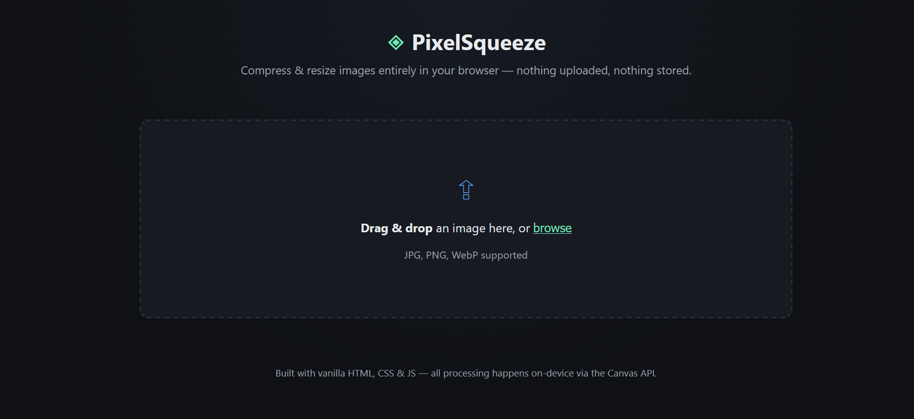

# PixelSqueeze 🗜️

**Image Compressor & Resizer** — a lightweight, no-backend web app that compresses and resizes images entirely in your browser using the Canvas API. No uploads, no server, no data ever leaves your device.

🔗 **Repository name:** `pixelsqueeze`

## Description

PixelSqueeze lets you drag-and-drop an image, adjust its quality and dimensions in real time, preview the before/after side by side, and download the optimized result — all client-side, powered by vanilla HTML, CSS, and JavaScript.

## Features

- 🖼️ Drag-and-drop or click-to-browse image upload
- 🎚️ Adjustable compression quality (1–100%)
- 📐 Resize by width/height with optional aspect-ratio lock
- 🔄 Convert between JPEG, PNG, and WebP
- ⚡ Live before/after preview with file size comparison
- 📉 Shows percentage size reduction
- 💾 One-click download of the compressed image
- 🔒 100% client-side — no image is ever uploaded to a server
- 📱 Responsive, dark-themed UI

## Tech Stack

- HTML5 (Canvas API, File API, Drag & Drop API)
- CSS3 (custom properties, responsive grid)
- Vanilla JavaScript (no frameworks, no build step)

## Getting Started

No installation or dependencies required.

```bash
git clone https://github.com/<your-username>/pixelsqueeze.git
cd pixelsqueeze
```

Then simply open `index.html` in your browser — or serve it locally:

```bash
# Python
python -m http.server 8000

# Node
npx serve .
```

Visit `http://localhost:8000` and start compressing.

## Deploy on GitHub Pages

1. Push this repo to GitHub.
2. Go to **Settings → Pages**.
3. Under **Source**, select the `main` branch and `/ (root)` folder.
4. Your app will be live at `https://<your-username>.github.io/pixelsqueeze/`.

## Project Structure

```
pixelsqueeze/
├── index.html   # App layout and structure
├── style.css    # Dark-themed responsive styling
├── script.js    # Compression/resizing logic (Canvas API)
└── README.md
```

# Screenhots


## How It Works

1. The uploaded image is drawn onto an off-screen `<canvas>` at the target width/height.
2. `canvas.toBlob()` re-encodes the canvas into the chosen format (JPEG/WebP/PNG) at the selected quality.
3. The resulting blob is compared against the original file size and offered as a download — all without any network request.

## License

MIT — free to use, modify, and distribute.

## Author

Built as part of an MCA coursework project.
